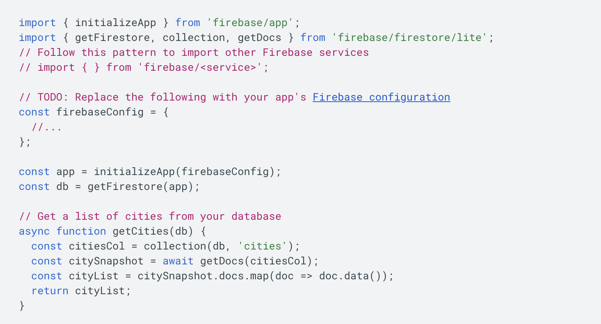

---
# You can also start simply with 'default', 'seriph', 'penguin'
theme: ../slidev-theme-firebase
# random image from a curated Unsplash collection by Anthony
# like them? see https://unsplash.com/collections/94734566/slidev
background: https://cover.sli.dev
# some information about your slides (markdown enabled)
title: Firebase Training
info: |
  ## Firebase Training
  Presentation slides for developers.
# apply unocss classes to the current slide
class: text-center
# https://sli.dev/features/drawing
drawings:
  persist: false
# slide transition: https://sli.dev/guide/animations.html#slide-transitions
transition: slide-left
# enable MDC Syntax: https://sli.dev/features/mdc
mdc: true
# open graph
# seoMeta:
#  ogImage: https://cover.sli.dev
layout: intro
highlighter: shiki
themeConfig:
  # logoHeader: '/avatar.png'
  eventLogo: 'https://www.nustechnology.com/_next/image/?url=%2Fimg%2Flogo.png&w=64&q=75'
  eventUrl: 'https://www.nustechnology.com/'
  # twitter: '@alvarosabu'
  # twitterUrl: 'https://twitter.com/alvarosabu'
---

<h1>Welcome to <span>Firebase</span> Training Full-stack Development</h1>

## NUS Technology, 26 July 2025

<style>
  h1 {
    span {
      color: #FF9100;
    }
  }
</style>

---
transition: slide-left
layout: center
---

# 🚀 Agenda

1. Introduction to Firebase

2. Firebase Auth (Client + Server)

3. Cloud Firestore

4. Cloud Functions

5. Demo Project & Hands-on

<style>
  .slidev-layout p, .slidev-layout li {
    font-size: 1.1em
  }
</style>


---
transition: slide-left
layout: center
---

# Introduction to Firebase

<v-clicks>

## What is Firebase?

- Google’s platform for building and scaling web & mobile apps

- Complete ecosystem for building web and mobile apps (Backend-as-a-Service):

  Offers hosting, Auth, Database, Serrverless Functions, Analytics.

## Core Products We'll Cover

- **Firebase Authentication**

- **Cloud Firestore**: NoSQL database with real-time capabilities

- **Cloud Functions**: Serverless backend, compute for your application logic

- **Firebase Admin SDK**: For secure server-side operations

</v-clicks>

<style>
  h1 {
    span {
      color: #FF9100;
    }
  }
  .slidev-layout p, .slidev-layout li {
    font-size: 1.1em
  }
</style>


---
transition: slide-left
layout: center
---

# 🤩 Highlight key benefits:

<v-clicks>

* Zero server management needed - fully managed backend

* Real-time database and hosting capabilities

* Built-in authentication and security rules

* Analytics and crash reporting included

* Integrates well with other Google Cloud services

</v-clicks>

<style>
  .slidev-layout p, .slidev-layout li {
    font-size: 1.1em
  }
</style>

---
layout: center
transition: slide-left
---

# 💰 Pricing model

<v-clicks>

* Free tier available for development/testing (Spark plan)

* Pay-as-you-go based on usage (Blaze plan)

* No upfront costs or commitments required

</v-clicks>

<style>
  .slidev-layout p, .slidev-layout li {
    font-size: 1.1em
  }
</style>


---
transition: slide-left
layout: center
---

#### Comparation 🆚 Traditional Stack

<v-clicks>

| Aspect                  | 🔥 Firebase Fullstack                            | 🛠️ Traditional Fullstack                          |
|-------------------------|--------------------------------------------------|---------------------------------------------------|
| **Authentication**      | Built-in Firebase Auth (email, Google, phone)    | Custom logic or libraries (Passport.js, Devise)   |
| **Backend**             | Serverless with Cloud Functions                  | Self-managed backend (Node.js, Rails, Django)     |
| **Database**            | Firestore / Realtime Database (NoSQL, real-time) | SQL (PostgreSQL, MySQL) or NoSQL (MongoDB)        |
| **Hosting**             | Firebase Hosting (CDN-backed, CLI deploy)        | Custom setup (Heroku, AWS, VPS, Docker)           |
| **DevOps / Deployment** | Simple via `firebase deploy`                     | Requires CI/CD, infrastructure setup              |
| **Scalability**         | Auto-scales with no config                       | Manual or cloud-managed scaling                   |
| **Real-time Support**   | Native with `onSnapshot`, built-in               | Requires WebSockets or Socket.io                  |
| **Vendor Lock-in**      | High – tied to Google                            | Low – full flexibility                            |
| **Pricing**             | Free tier + pay-as-you-go                        | Depends on infra; can be optimized                |
| **Learning Curve**      | Easier for frontend devs                         | Steeper – backend & infra knowledge needed        |

</v-clicks>

<style>
table {
  font-size: 0.85em;
  margin-top: 0;
  margin-bottom: 0;
}
</style>

---
transition: slide-left
layout: center
---

#### ✅ When to Use

<v-clicks>

| Scenario                                                        | Recommended Stack      |
|-----------------------------------------------------------------|------------------------|
| MVPs, Startups, Rapid prototyping                               | <span style="color: #FF9100">Firebase</span>     |
| Mobile first, Real-time features (chat, feed)                   | <span style="color: #FF9100">Firebase</span>     |
| Teams without DevOps expertise                                  | <span style="color: #FF9100">Firebase</span>     |
| Enterprise system / Custom backend                              | Traditional Fullstack  |
| Security / Compliance-heavy projects / custom business logic    | Traditional Fullstack  |
| Avoid vendor lock-in                                            | Traditional Fullstack  |

</v-clicks>

<style>
table {
  font-size: 1.1em;
  margin-top: 0;
  margin-bottom: 0;
}
</style>

---
transition: slide-left
layout: default
---

# Add Firebase to your project

<v-switch>
  <template #1>
    Step 1: Create a Firebase project and Register your app in Firebase Console
    <p></p>
    
  </template>
  <template #2>
    Step 1: Create a Firebase project and Register your app
    <p></p>
    
  </template>
  <template #3>
    Step 2: Create a Firebase project and Register your app
    <p></p>
    
  </template>
  <template #4>
    Step 2: Create a Firebase project and Register your app
    <p></p>
    
  </template>
  <template #5>
    Step 3: Install the SDK and initialize Firebase
    <p></p>
    <code> npm install firebase </code>
    <p></p>
    
  </template>
  <template #6>
    Step 4: Access Firebase in your app
    <p></p>
    
  </template>
</v-switch>


---
transition: slide-left
layout: center
---

# Firebase Auth

<v-clicks>

- Firebase Authentication provides backend services, easy-to-use SDKs, and ready-made UI libraries to authenticate users to your app.

- It supports authentication using email & password, phone number, popular identity providers like Google, Facebook, Twitter, Github and more.

- Zero infrastructure setup required

- Multi-platform SDK support: iOS, Android, Flutter, Web, C++, Unity, NodeJs, Java

- Admin SDK for user management: manage users, verify tokens, control access with Custom Claims

</v-clicks>

<style>
  .slidev-layout p, .slidev-layout li {
    font-size: 1.1em
  }
</style>

---
transition: slide-left
layout: center
---

# Firebase Auth: Authentication Process


---
transition: slide-left
layout: center
---

# Getting Started with Firebase Auth

<v-clicks>

## Integration Steps

1. Enable Auth in Firebase Console

2. Add Firebase SDK to your app

3. Choose auth providers

4. Implement sign-in flows

</v-clicks>

<style>
  .slidev-layout p, .slidev-layout li {
    font-size: 1.1em
  }
</style>

---
layout: center
transition: slide-left
---

# Code Example

<v-clicks>
````md magic-move
```js

// Firebase Config
import { initializeApp } from 'firebase/app';

import {
  getAuth,
  createUserWithEmailAndPassword,
  signInWithEmailAndPassword
} from 'firebase/auth';

```

```js

// TODO: Replace the following with your app's Firebase project configuration
// See: https://firebase.google.com/docs/web/learn-more#config-object
const firebaseConfig = {
  apiKey: "AIzaSyB6219ZurDDPohHOAeHTGN77N",
  authDomain: "firebase-lab.firebaseapp.com",
  projectId: "firebase-lab",
  storageBucket: "firebase-lab.firebasestorage.app",
  messagingSenderId: "280948366364",
  appId: "1:280948366364:web:78e46757414fa9b721d3d9",
  measurementId: "G-B5B620WY50"
};

```

```js

// Initialize Firebase
const app = initializeApp(firebaseConfig);

// Initialize Firebase
const auth = getAuth(app);

```

```js

// Sign Up
const handleSignUp = async () => {
  try {
    const userCredential = await createUserWithEmailAndPassword(
      auth, email, password
    );
    console.log('User created:', userCredential.user.email);
  } catch (error) {
    console.error('Error:', error.message);
  }
};

```

```js

// Sign In
const handleSignIn = async () => {
  try {
    const userCredential = await signInWithEmailAndPassword(
      auth, email, password
    );
    console.log('Signed in:', userCredential.user.email);
  } catch (error) {
    console.error('Error:', error.message);
  }
};

```

````
</v-clicks>

---
layout: center
transition: slide-left
---

# Sign in with identity providers

<v-clicks>

````md magic-move
```js {8,9,10}{lines:true}
// Firebase Config
import { initializeApp } from 'firebase/app';

import {
  getAuth,
  createUserWithEmailAndPassword,
  signInWithEmailAndPassword,
  GoogleAuthProvider,
  GithubAuthProvider,
  signInWithPopup,
} from 'firebase/auth';
```

```js
const handleSignInWithGoogle = async () => {
  try {
    const provider = new GoogleAuthProvider();
    await signInWithPopup(auth, provider);
  } catch (error) {
    console.error('Error:', error.message);
  }
}


const handleSignInWithGithub = async () => {
  try {
    const provider = new GithubAuthProvider();
    await signInWithPopup(auth, provider);
  } catch (error) {
    console.error('Error:', error.message);
  }
}
```
````
</v-clicks>


---
layout: center
transition: slide-left
---

# Firebase Auth: Admin SDK (Server Side)

The Firebase Admin SDK allows you to integrate your own servers with Firebase Authentication

<v-clicks>

- Manage User Accounts: CRUD user account programmatically

- Custom Authentication: You can integrate an external user system with Firebase

- Identity Verification: Verify ID Tokens

- Custom User Claims: In some cases, you may want to implement fine-grained access control for users

</v-clicks>

<style>
  .slidev-layout p, .slidev-layout li {
    font-size: 1.1em
  }
</style>


---
layout: center
transition: slide-down
---

# Server-side Auth Example

<v-clicks>

````md magic-move
```js
// server.js
const express = require('express');
const cors = require('cors');
const admin = require('firebase-admin');
const { getAuth } = require('firebase-admin/auth');

// Initialize Firebase Admin SDK with your service account
const serviceAccount = require('./fir-lab-3aae2-firebase-adminsdk-fbsvc-2831c93efe.json');

admin.initializeApp({
  credential: admin.credential.cert(serviceAccount)
});
```

```js {9,17}{lines:true}
// Middleware to verify Firebase ID token
const authenticateUser = async (req, res, next) => {
  const authHeader = req.headers.authorization;

  if (!authHeader || !authHeader.startsWith('Bearer ')) {
    return res.status(401).json({ error: 'Unauthorized: No token provided' });
  }

  const idToken = authHeader.split('Bearer ')[1];

  console.log('====================');
  console.log('✨ Authorization header:', authHeader);
  console.log('✨ ID Token received:', idToken);
  console.log('====================');

  try {
    const decodedToken = await admin.auth().verifyIdToken(idToken);
    // Log the decoded token for debugging
    console.log('====================');
    console.log('✨ Decoded token:', decodedToken);
    console.log('====================');
    // Optionally, you can log the user claims
    console.log('permission from claims', decodedToken.permissions)
    req.user = decodedToken;
    next();
  } catch (error) {
    console.error('Error verifying token:', error);
    return res.status(401).json({ error: 'Unauthorized: Invalid token' });
  }
};
```

```js
// API endpoint to verify authentication
app.get('/api/auth/verify', authenticateUser, (req, res) => {
  // Return user information from the decoded token
  const currentUser = req.user;
  console.log('====================');
  console.log('✨ Authenticated user:', currentUser);
  console.log('✨ Custom User Claims:', currentUser.permissions);
  console.log('====================');
  res.json({
    uid: currentUser.uid,
    email: currentUser.email,
    emailVerified: currentUser.email_verified,
    name: currentUser.name,
    picture: currentUser.picture,
    authTime: new Date(currentUser.auth_time * 1000).toISOString(),
    provider: currentUser.firebase.sign_in_provider,
    permissions: currentUser.permissions || [],
    role: currentUser.role || '',
    subscriptionTier: currentUser.subscriptionTier || 'fee',
  });
});
```
````

<!--
Using a service account ID
To maintain consistency between various parts of your application, you can specify a service account ID whose keys will be used to sign tokens when running in a Google-managed environment. This can make IAM policies simpler and more secure, and avoid having to include the service account JSON file in your code.

he service account ID can be found in the Google Cloud console, or in the client_email field of a downloaded service account JSON file. Service account IDs are email addresses that have the following format: <client-id>@<project-id>.iam.gserviceaccount.com. They uniquely identify service accounts in Firebase and Google Cloud projects.

initializeApp({
  serviceAccountId: 'my-client-id@my-project-id.iam.gserviceaccount.com',
});
-->

</v-clicks>

---
layout: center
transition: slide-left
---

# Firebase Auth: Control Access with Custom Claims

<v-clicks>

- The Firebase Admin SDK supports defining custom attributes on user accounts.

- Role-based Access Control

- Defining different groups that a user belongs to

</v-clicks>

<style>
  .slidev-layout p, .slidev-layout li {
    font-size: 1.1em
  }
</style>

---
layout: center
transition: slide-left
---

# Firebase Auth: Control Access with Custom Claims

#### Backend Side:

- using ```setCustomUserClaims```

````md magic-move
```js
app.get('/api/set-custom-claims/:uid', async (req, res) => {
  try {
    // Get the user UID from the request parameters
    const uid = req.params.uid;
    // Set custom claims for the user
    await admin.auth().setCustomUserClaims(uid, {
      role: 'admin', // Example role
      permissions: ['read', 'write', 'delete'], // Example permissions
      subscriptionTier: 'testPlan', // Example subscription tier
      premium: true, // Example premium status
    });
    res.status(200).json({
      success: true,
      message: 'Custom claims have been set successfully.'
    });
  } catch (error) {
    console.error('Error setting custom claims:', error);
    return res.status(500).json({ error: 'Failed to set custom user claims' });
  }
});

```

```js {9-12}{lines:true}
// Middleware to verify Firebase ID token
const authenticateUser = async (req, res, next) => {
  const authHeader = req.headers.authorization;
  if (!authHeader || !authHeader.startsWith('Bearer ')) {
    return res.status(401).json({ error: 'Unauthorized: No token provided' });
  }
  const idToken = authHeader.split('Bearer ')[1];
  try {
    const decodedToken = await admin.auth().verifyIdToken(idToken);
    console.log('====================');
    console.log('✨ Permissions:', decodedToken.permissions);
    console.log('====================');

    req.user = decodedToken;
    next();
  } catch (error) {
    console.error('Error verifying token:', error);
    return res.status(401).json({ error: 'Unauthorized: Invalid token' });
  }
};
```

```js
// Additional Server-side middleware to check user's role
const requireAdminRole = (req, res, next) => {
  const currentUser = req.user;
  if (!currentUser || currentUser.role !== 'admin') {
    return res.status(403).json({
      error: 'Forbidden: Admin role required'
    });
  }
  next();
}
```

```js
// API route with admin check
app.get('/api/admin/users', authenticateUser, requireAdminRole, async (req, res) => {
  try {
    const users = await admin.auth().listUsers();
    res.json(users.users.map(user => ({
      uid: user.uid,
      email: user.email,
      emailVerified: user.emailVerified,
      displayName: user.displayName,
      photoURL: user.photoURL,
      customClaims: user.customClaims || {}
    })));
  } catch (error) {
    console.error('Error fetching admin users:', error);
    res.status(500).json({ error: 'Failed to fetch admin users' });
  }
});
```
````


---
layout: default
transition: slide-left
---

# Firebase Auth: Demo & Testing with Emulator

<v-clicks>

- Firebase Local Emulator Suite allows testing **without touching production**

- Includes emulators for Auth, Firestore, Functions, and more

- Perfect for automated tests and local development

- No cost - runs completely offline

</v-clicks>

<style>
  .slidev-layout p, .slidev-layout li {
    font-size: 1.1em
  }
</style>

---
layout: center
transition: slide-left
---

# Setting Up Auth Emulator

<v-clicks>

1. Install Firebase CLI

```bash
npm install -g firebase-tools
```

2. Init Firebase project

```bash
firebase init
```

3. start emulator suite

```bash
firebase emulators:start
```

</v-clicks>

<style>
  .slidev-layout p, .slidev-layout li {
    font-size: 1.1em
  }
</style>

---
layout: center
transition: fade
---

<v-switch>
  <template #1>
    
  </template>

  <template #2>
    
  </template>

  <template #3>
    
  </template>
</v-switch>


---
layout: center
transition: slide-left
---

# Connect your app with Emulators

<v-clicks>
````md magic-move
```js
// Web client (React, Vue, etc.)
import { getAuth, connectAuthEmulator } from "firebase/auth";

const auth = getAuth();
if (process.env.NODE_ENV === 'development') {
  // Connect to local emulator
  connectAuthEmulator(auth, "http://localhost:9099");
}
```

```js
// Server-side (Node.js)
const { initializeApp } = require('firebase-admin/app');
const { getAuth } = require('firebase-admin/auth');

const app = initializeApp({
  projectId: 'demo-project'
});

if (process.env.NODE_ENV === 'development') {
  process.env.FIREBASE_AUTH_EMULATOR_HOST = 'localhost:9099';
  console.log('✨ Using Firebase Auth Emulator');
}

const auth = getAuth();
```
````
</v-clicks>


---
transition: slide-left
layout: center
---

# Cloud Firestore

<v-clicks>

- Google's NoSQL document database

- Built for scale and performance: Typical uptime performance of 99.999%

- Store your data in documents, organized into collections

- Documents can contain complex nested objects in addition to subcollections

- Trusted by more than 250,000 developers

- Offers low latency client synchronization and offline data access

</v-clicks>

<style>
  .slidev-layout p, .slidev-layout li {
    font-size: 1.1em
  }
</style>

---
transition: slide-left
layout: center
---

# Data model

<v-clicks>

- Cloud Firestore is schemaless, so you have complete freedom over what fields you put in each document and what data types you store in those fields.

- **Collections**: containers for documents

- **Documents**: key-value pairs with typed fields

- **Subcollections**: nested collections within documents

- **References**: pointers to documents. Every document in Cloud Firestore is uniquely identified by its location within the database.

```
users (collection)
  └── user123 (document)
      ├── name: "Alice Smith"
      ├── email: "alice@example.com"
      └── posts (subcollection)
          ├── post1 (document)
          │   └── title: "Hello World"
          └── post2 (document)
              └── title: "Firebase is cool"
```

</v-clicks>

<style>
  .slidev-layout p, .slidev-layout li {
    font-size: 1.1em
  }
</style>

---
transition: slide-left
layout: two-cols
---

# Supported Data Types in Firestore

<v-clicks>

- **String**: Text data
- **Number**: Integer or floating point
- **Boolean**: true/false values
- **Null**: Empty/undefined values
- **Timestamp**: Date and time values
- **GeoPoint**: Latitude and longitude coordinates
- **Array**: Ordered list of values
- **Map**: Nested objects with key-value pairs
- **Reference**: Pointer to another document
- **Bytes**: Binary data

</v-clicks>

::right::

<v-clicks>

```js
// Example document with various data types
const document = {
  name: "John Doe",               // String
  age: 30,                        // Number
  isActive: true,                 // Boolean
  bio: null,                      // Null
  createdAt: Timestamp.now(),     // Timestamp
  location: new GeoPoint(37.7, -122.4), // GeoPoint
  tags: ["firebase", "web"],      // Array
  settings: {                     // Map (nested object)
    theme: "dark",
    notifications: true
  },
  friendRef: doc(db, "users", "friend123"), // Reference
  profilePic: Bytes.fromBase64String("...") // Bytes
};
```

</v-clicks>

<style>
  .slidev-layout p, .slidev-layout li {
    font-size: 1.1em
  }
</style>

---
transition: slide-left
layout: center
---

# Limitations

<v-clicks>

- Maximum size for a document	1 MiB (1,048,576 bytes)

- Maximum depth of subcollections is 100

- Maximum depth of fields in a map or array	is 20

- Constraints on field names: Must be valid UTF-8 characters

</v-clicks>

<style>
  .slidev-layout p, .slidev-layout li {
    font-size: 1.1em
  }
</style>

---
transition: fade
layout: image-right
image: /images/nested.png
backgroundSize: contain
---

# Structure data

### Nested data in documents

<v-clicks>

- You can nest complex objects (array, maps) within documents

- ✅ If you have simple, fixed lists of data that you want to keep within your documents

- ❌ Not as scalable as other options, especially if your data expands over time, can lead to slower document retrieval times

- 🧐 What's a possible use case?

Example in chat app, you might store a user's 3 most recently visited chat rooms as a nested list in their profile.

</v-clicks>

<style>
  .slidev-layout p, .slidev-layout li {
    font-size: 1em
  }
</style>

---
transition: fade
layout: image-right
image: /images/subcollections.png
backgroundSize: contain
---

# Structure data

### Subcollections

<v-clicks>

- You can create collections within documents when you have data that might expand over time.

- ✅ As your lists grow, the size of the parent document doesn't change. You also get full query capabilities on subcollections

- ❌ You can't easily delete subcollections.

- 🧐 What's a possible use case?

In the same chat app, for example, you might create collections of users or messages within chat room documents.

</v-clicks>

<style>
  .slidev-layout p, .slidev-layout li {
    font-size: 1em
  }
</style>

---
transition: fade
layout: image-right
image: /images/rootcollections.png
backgroundSize: contain
---

# Structure data

### Root-level collections

<v-clicks>

- Create collections at the root level of your database to organize disparate data sets.

- ✅ Root-level collections are good for many-to-many relationships and provide powerful querying within each collection.

- ❌ Getting data that is naturally hierarchical might become increasingly complex as your database grows.

- 🧐 What's a possible use case?

In the same chat app, for example, you might create one collection for users and another for rooms and messages.

</v-clicks>

<style>
  .slidev-layout p, .slidev-layout li {
    font-size: 1em
  }
</style>


---
transition: slide-left
layout: center
---

# Initialize Cloud Firestore

```js {9|20}{lines:true}
// Firebase Config
import { initializeApp } from 'firebase/app';
import {
  getAuth,
  createUserWithEmailAndPassword,
  signInWithEmailAndPassword
} from 'firebase/auth';

import { getFirestore } from 'firebase/firestore'

const firebaseConfig = {
// Config keys here
};
// Initialize Firebase
const app = initializeApp(firebaseConfig);
// Initialize Firebase
const auth = getAuth(app);

// Initialize Firestore
const db = getFirestore(app);

console.log('Initialize Cloud Firestore and get a reference to the service')
```


---
transition: slide-left
layout: center
---

# Adding Data to Firestore

````md magic-move
```js
import {
  collection,
  addDoc,
  setDoc,
  doc,
  updateDoc,
  deleteDoc
} from "firebase/firestore";

// Collection reference
const citiesRef = collection(db, "cities");
```

```js
const addCity = async () => {
  try {
    // Init the reference to collection
    const citiesRef = collection(db, "cities");
    // City data
    const params = {
      name: 'Tokyo',
      state: null,
      country: 'Japan',
      capital: true,
      population: 9000000
    }
    // Add a document with auto-generated ID
    const docRef = await addDoc(citiesRef, params);
    console.log("Document written with ID: ", docRef.id);
    return docRef;
  } catch (e) {
    console.error("Error adding document: ", e);
  }
};
```

```js
const createCityWithId = async (cityId) => {
  try {
    // City data
    const params = {
      name: 'Tokyo',
      state: null,
      country: 'Japan',
      capital: true,
      population: 9000000
    }
    // Set a document with custom ID
    // If the document does not exist, it will be created
    // If the document does exist, its contents will be overwritten with the newly provided data
    await setDoc(doc(db, "cities", cityId), params);
    console.log("Document written with ID: ", cityId);
  } catch (e) {
    console.error("Error setting document: ", e);
  }
};
```

```js
const updateCity = async (cityId, updates) => {
  try {
    const params = { name: "Osaka" }
    const cityRef = doc(db, "cities", cityId);
    // Update a document
    await updateDoc(cityRef, params);
    console.log("Document updated");
  } catch (e) {
    console.error("Error updating document: ", e);
  }
};
```

```js
const deleteCity = async (cityId) => {
  try {
    // Delete a document
    await deleteDoc(doc(db, "cities", cityId));
    console.log("Document deleted");
  } catch (e) {
    console.error("Error deleting document: ", e);
  }
};
```

```js
// Update fields in nested objects
// Create an initial document to update.
const userDocRef = doc(db, "users", "frank");
await setDoc(frankDocRef, {
  name: "Frank",
  favorites: { food: "Pizza", color: "Blue", subject: "recess" },
  age: 12
});

// To update age and favorite color: Using Dot notation
// Dot notation allows you to update a single nested field
// without overwriting other nested fields.
await updateDoc(frankDocRef, {
  "age": 13,
  "favorites.color": "Red"
});

```


```js
// Server Timestamp
import { updateDoc, serverTimestamp } from "firebase/firestore";

const docRef = doc(db, 'objects', 'some-id');

// Update the timestamp field with the value from the server
const updateTimestamp = await updateDoc(docRef, {
  createdAt: serverTimestamp(), // 23/07/2025, 13:14:54
  updatedAt: serverTimestamp(), // 23/07/2025, 13:14:54
});

```
````

---
transition: slide-left
layout: default
---

# Bonus 🎁: Updating data with transactions

<v-clicks>

- Cloud Firestore allow group multiple operations into a single transaction

- Firestore Transaction: consists of number of `get()` operations followed by any number of write operations such as `set()`, `update()`, or `delete()`.

- if a transaction reads documents and another client modifies any of those documents, Cloud Firestore retries the transaction.

- This feature ensures that the transaction runs on up-to-date and consistent data.

- Transactions will fail when the client is offline.

</v-clicks>

<style>
  .slidev-layout p, .slidev-layout li {
    font-size: 1.1em
  }
</style>

<!--
When using transactions, note that:

Read operations must come before write operations.
A function calling a transaction (transaction function) might run more than once if a concurrent edit affects a document that the transaction reads.
Transaction functions should not directly modify application state.
Transactions will fail when the client is offline.

Do not modify application state inside of your transaction functions. Doing so will introduce concurrency issues, because transaction functions can run multiple times and are not guaranteed to run on the UI thread.

-->


---
transition: slide-left
layout: center
---

## Example using Firestore Transaction

```js

import { doc, runTransaction } from "firebase/firestore";

// Create a reference to the SF doc.
const sfDocRef = doc(db, "cities", "SF");
const sfDocRefOther = doc(db, "cities", "NY");

try {
  const newPopulation = await runTransaction(db, async (transaction) => {
    const sfDoc = await transaction.get(sfDocRef);
    const sfDocOther = await transaction.get(sfDocRefOther);

    if (!sfDoc.exists() || !sfDocRefOther.exists()) {
      throw "Document does not exist!";
    }

    const newPop = sfDoc.data().population + 1;
    transaction.update(sfDocRef, { population: newPop });
    transaction.update(sfDocOther, { name: "NYC" });

    return newPop;
  });

  console.log("Population increased to ", newPopulation);
  console.log("Transaction successfully committed!");
} catch (e) {
  console.log("Transaction failed: ", e);
}
```

<!--
Transaction failure
A transaction can fail for the following reasons:

The transaction contains read operations after write operations. Read operations must always come before any write operations.
The transaction read a document that was modified outside of the transaction. In this case, the transaction automatically runs again. The transaction is retried a finite number of times.
The transaction exceeded the maximum request size of 10 MiB.

Transaction size depends on the sizes of documents and index entries modified by the transaction. For a delete operation, this includes the size of the target document and the sizes of the index entries deleted in response to the operation.

A failed transaction returns an error and does not write anything to the database. You do not need to roll back the transaction; Cloud Firestore does this automatically.
-->

---
transition: slide-left
layout: default
---

# Bonus 🎁 🎁: Batched writes

```js
import { writeBatch, doc } from "firebase/firestore";

// Get a new write batch
const batch = writeBatch(db);

// Set the value of 'NYC'
const nycRef = doc(db, "cities", "NYC");
batch.set(nycRef, {name: "New York City"});

// Update the population of 'SF'
const sfRef = doc(db, "cities", "SF");
batch.update(sfRef, {"population": 1000000});

// Delete the city 'LA'
const laRef = doc(db, "cities", "LA");
batch.delete(laRef);

// Commit the batch
await batch.commit();
```

<!--
Like transactions, batched writes are atomic. Unlike transactions, batched writes do not need to ensure that read documents remain un-modified which leads to fewer failure cases.

They are not subject to retries or to failures from too many retries.

Batched writes execute even when the user's device is offline.

A batched write with hundreds of documents might require many index updates and might exceed the limit on transaction size. In this case, reduce the number of documents per batch. To write a large number of documents, consider using a bulk writer or parallelized individual writes instead.


-->


---
transition: slide-left
layout: center
---

# Reading Data

<v-clicks>

````md magic-move

```js
import { doc, collection,
  getDoc,
  getDocs,
  query,
  where,
  orderBy, limit
} from "firebase/firestore";

// Get a single document
const getCity = async (cityId) => {
  const docRef = doc(db, "cities", cityId);
  const docSnapshot = await getDoc(docRef);

  if (docSnapshot.exists()) {
    console.log("Document data:", docSnapshot.data());
    return { id: docSnapshot.id, ...docSnapshot.data() };
  } else {
    // docSnapshot.data() will be undefined in this case
    console.log("No such document!");
    return null;
  }
};
```

```js
// Source options

// Attempts to get the latest data from the server.
// If the server can’t be reached (e.g., offline),
// => returns data from the local cache instead.
// This is the default behavior.
await getDoc(docRef, { source: "default" })
// Forces the call to fetch data only from the server.
// If the server is unreachable, an error is returned. Cache is ignored.
await getDoc(docRef, { source: "server" })
// Fetches data only from the local offline cache.
await getDoc(docRef, { source: "cache" })

```

````

</v-clicks>

<style>
  .slidev-layout .slidev-code-wrapper {
    max-width: 100%;
  }
</style>


---
transition: slide-left
layout: center
---

# Get multiple documents from a collection

<v-clicks>

````md magic-move
```js
// Query documents
import { collection, query, where, getDocs } from "firebase/firestore";

// Fetch a list of documents from Firestore with a query
const qquery = query(collection(db, "cities"), where("capital", "==", true));
const querySnapshot = await getDocs(qquery);

// Example: Fetch all documents in the "cities" collection
// const querySnapshot = await getDocs(collection(db, "cities"));

querySnapshot.forEach((doc) => {
  // doc.data() is never undefined for query doc snapshots
  console.log("Query result: ", doc.id, " => ", doc.data());
});

```
```js
```
````

</v-clicks>

<style>
  .slidev-layout .slidev-code-wrapper {
    max-width: 100%;
  }
</style>


---
transition: slide-left
layout: center
---

# Query & Order & Limit

<v-clicks>

````md magic-move

```js
// Create a reference to the cities collection
import { collection, query, where } from "firebase/firestore";
const citiesRef = collection(db, "cities");

// Create a query against the collection.
const q = query(citiesRef, where("state", "==", "CA"));
const q = query(citiesRef, where("capital", "==", true));

const querySnapshot = await getDocs(q);
```

```js
const notCapitalQuery = query(citiesRef, where("capital", "!=", false));

const q = query(citiesRef, where("regions", "array-contains", "west_coast"));

const q = query(citiesRef, where('country', 'in', ['USA', 'Japan']));

const q = query(citiesRef,
  where('regions', 'array-contains-any', ['west_coast', 'east_coast']));
```

```js

const q2 = query(citiesRef, where("state", "==", "CA"), where("population", "<", 1000000));

const q = query(citiesRef,
  or(where('capital', '==', true),
     where('population', '>=', 1000000)
  )
);

```

```js

import { query, orderBy, limit } from "firebase/firestore";

const q = query(citiesRef, orderBy("name"), limit(3));

const q = query(citiesRef, orderBy("name", "desc"), limit(3));

const q = query(citiesRef, orderBy("state"), orderBy("population", "desc"));
```

````
</v-clicks>

<style>
  .slidev-layout .slidev-code-wrapper {
    max-width: 100%;
  }
</style>


---
transition: slide-left
layout: center
---

# Get realtime updates with Cloud Firestore

<v-clicks>

````md magic-move

```js
// Listen to a document
import { doc, onSnapshot } from "firebase/firestore";

const unsub = onSnapshot(doc(db, "cities", "SF"), (doc) => {
    console.log("Current data: ", doc.data());
});
```

```js
// Listen to a query
import { collection, query, where, onSnapshot } from "firebase/firestore";

const q = query(collection(db, "cities"), where("state", "==", "CA"));

const unsubscribe = onSnapshot(q, (querySnapshot) => {
  const cities = [];
  querySnapshot.forEach((doc) => {
      cities.push(doc.data().name);
  });
  console.log("Current cities in CA: ", cities.join(", "));
});
```

```js
// Usage with React
import { doc, collection, onSnapshot, query, where } from "firebase/firestore";

const listenToCity = (cityId, callback) => {
  const unsubscribe = onSnapshot(
    doc(db, "cities", cityId),
    (doc) => {
      if (doc.exists()) {
        callback({ id: doc.id, ...doc.data() });
      } else {
        callback(null);
      }
    },
    (error) => {
      console.error("Listen failed: ", error);
    }
  );

  // Return unsubscribe function for cleanup
  return unsubscribe;
};
```
````

</v-clicks>

<style>
  .slidev-layout .slidev-code-wrapper {
    max-width: 100%;
  }
</style>

<!--

How Real-time Updates Work in Cloud Firestore
	•	Real-time listeners like `onSnapshot()` open a persistent connection to Firestore, listening for any additions, modifications, or deletions of documents in the specified collection or query.
	•	When the Firestore backend detects changes, it pushes only the changed data to your client instantly, instead of you having to poll repeatedly for updates.
	•	This listener triggers the callback function with a snapshot object representing the current state of the data at that moment, ensuring your UI stays in sync with the database in real-time.
	•	The snapshot contains all matching documents, allowing you to update your local state (like your `setCities` call) with fresh data whenever updates happen.

Your code explained:
	•	`onSnapshot(collection(db, 'cities'), ...)` sets up a live subscription to the `cities` collection.
	•	When any document in `cities` changes, your callback receives a `snapshot` containing the updated documents.
	•	Inside the callback, you map over the snapshot’s `docs` to create a list of city objects with their IDs.
	•	The state (`setCities`) updates to reflect these changes, and a console log confirms the update.
	•	If an error occurs during snapshot listening, the error callback handles it gracefully.
	•	The returned function (`unsubscribe`) stops listening when the component unmounts or the listener is no longer needed.

-->

---
transition: slide-left
layout: center
---

# Security Rules

<v-clicks>

- Provides a powerful, rule-based security system to control who can access or modify your database

- Combining with Firebase Auth, you can enforce fine-grained access ensuring each user or group only gets the data they’re allowed to see or modify.


```js
rules_version = '2';
service cloud.firestore {
  match /databases/{database}/documents {
    // Allow the user to access documents in the "cities" collection
    // only if they are authenticated.
    match /cities/{city} {
      allow read, write: if request.auth != null;
    }
  }
}
```

</v-clicks>

<style>
  .slidev-layout .slidev-code-wrapper {
    max-width: 100%;
  }
  .slidev-layout p, .slidev-layout li {
    font-size: 1.1em
  }
</style>

---
transition: slide-left
layout: center
---

# Data validation

````md magic-move
```js
service cloud.firestore {
  match /databases/{database}/documents {
    // Allow the user to read data if the document has the 'visibility'
    // field set to 'public'
    match /cities/{city} {
      allow read: if resource.data.visibility == 'public';
    }
  }
}
```

```js
service cloud.firestore {
  match /databases/{database}/documents {
    // Make sure all cities have a positive population and
    // the name is not changed
    match /cities/{city} {
      allow update: if request.resource.data.population > 0
                    && request.resource.data.name == resource.data.name;
    }
  }
}
```

```js
service cloud.firestore {
  match /databases/{database}/documents {
    function isSignedIn() {
      return request.auth != null;
    }

    function isAdmin() {
      return isSignedIn() && request.auth.token.role == 'admin';
    }

    match /{document=**} {
      allow read, write: if isAdmin();  // Allow read and write access to admin users only
    }
  }
}
```
````

<style>
  .slidev-layout .slidev-code-wrapper {
    max-width: 100%;
  }
  .slidev-layout p, .slidev-layout li {
    font-size: 1.1em
  }
</style>

---
transition: slide-left
layout: center
---

# Data validation: How to retrieve other associated resource

````md magic-move
```js
service cloud.firestore {
  match /databases/{database}/documents {
    function isSignedIn() {
      return request.auth != null;
    }

    // using get() to retrieve user data
    function isAssignedAdminUser(userRef) {
      return get(/$(userRef)).data.role == 'admin';
    }

    match /cities/{cityId} {
      allow read, write: if isSignedIn();
    }

    match /profiles/{profileId} {
      // profile document has userRef reference to user document
      allow read, write: if isAssignedAdminUser(resource.data.userRef);
    }
  }
}
```
````

<style>
  .slidev-layout .slidev-code-wrapper {
    max-width: 100%;
  }
  .slidev-layout p, .slidev-layout li {
    font-size: 1.1em
  }
</style>

---
transition: slide-left
layout: center
---

# Testing with Firestore Emulator

<v-clicks>

1. **Setup the emulator**

```bash
# Install Firebase CLI
npm install -g firebase-tools

# Initialize Firebase project
firebase init

# Start the emulator suite
firebase emulators:start
```

2. **Connect app to emulator**

```javascript
import { connectFirestoreEmulator } from "firebase/firestore";

const db = getFirestore();
if (process.env.NODE_ENV === 'development') {
  connectFirestoreEmulator(db, 'localhost', 8080);
}
```

<style>
  .slidev-layout .slidev-code-wrapper {
    max-width: 100%;
  }
</style>

</v-clicks>

---
transition: slide-left
layout: center
---

# Disaster recovery planning for data

<v-clicks>

- Scheduled backups

 Backups support a maximum retention period of 14 weeks. You can schedule daily or weekly backups.

- Point-in-time recovery (PITR)

 PITR can recover the data to a point in time in the past (up to a maximum of 7 days)

</v-clicks>

<style>
  .slidev-layout p, .slidev-layout li {
    font-size: 1.1em
  }
</style>

---
transition: slide-left
layout: center
---

# Scheduled backups

<v-clicks>

- Create a daily/weekly backup schedule from Console

In the `Scheduled backups` column click either `View backups` or `Edit settings`, depending on whether a backup schedule exists.

- Using gcloud command:

```bash
gcloud firestore backups schedules create \
--database='DATABASE_ID' \
--recurrence=daily \
--retention=RETENTION_PERIOD
```

- Using firebase command:

```bash
firebase firestore:backups:schedules:create \
--database 'DATABASE_ID' \
--recurrence 'DAILY' \
--retention RETENTION_PERIOD
```

</v-clicks>

<style>
  .slidev-layout p, .slidev-layout li {
    font-size: 1.1em
  }
</style>

---
transition: slide-left
layout: center
---

# Point-in-time recovery (PITR)

- It is a disaster recovery feature

  Protect your data against accidental deletions or incorrect writes allowing you to restore data from previous points in time, up to 7 days in the past.

- Maintains historical versions of your document

- Enabling you to query or restore data as it existed at a specific time in the recent past

<style>
  .slidev-layout p, .slidev-layout li {
    font-size: 1.1em
  }
</style>

---
transition: slide-left
layout: center
---

# Point-in-time recovery (PITR)

```js
const firestore = firebase.firestore();
const docRef = firestore.collection("your_collection").doc("your_document");

const readTimestamp = firebase.firestore.Timestamp.fromMillis(Date.parse('YYYY-MM-DDTHH:MM:00Z'));
// Example: '2023-08-10T12:31:00Z'

firestore.runTransaction(async transaction => {
    const docSnapshot = await transaction.get(docRef, { readOnly: true, readTime: readTimestamp });
    if (docSnapshot.exists) {
        console.log("Document data at specified time:", docSnapshot.data());
    } else {
        console.log("Document did not exist at specified time.");
    }
});
```

<style>
  .slidev-layout .slidev-code-wrapper {
    max-width: 100%;
  }
</style>

---
transition: slide-left
layout: center
---

# Example export & import

````md magic-move

```bash
gcloud firestore export gs://your-bucket-name/backups/YYYY-MM-DD

gcloud firestore export gs://YOUR_BUCKET_NAME --snapshot-time="2025-07-15T08:00:00Z"

gcloud firestore import gs://your-bucket-name/backups/YYYY-MM-DD
```

```bash
firebase emulators:export ./emulator-backup

firebase emulators:start --import=./emulator-backup
```

````

<style>
  .slidev-layout .slidev-code-wrapper {
    max-width: 100%;
  }
</style>

---
transition: slide-left
---

# Cloud Functions

<v-clicks>

- Cloud Functions is a serverless framework

- Lets you automatically run backend code in response to events triggered by background events, HTTPS requests, the Admin SDK, or Cloud Scheduler jobs.

- Your JavaScript, TypeScript or Python code is stored on Google Cloud infrastructure and runs in a managed environment.

- There's no need to manage and scale your own servers!

</v-clicks>

---
transition: slide-left
---

# Explore use cases

<v-clicks>

- Notify users when something interesting happens

- Perform database sanitization and maintenance

- Integrate with third-party services and APIs.

- Execute intensive tasks in the cloud instead of in your app:

  1. Convert image to thumbnail

  2. Send bulk emails

  3. Aggregate and summarize data

  4. Process a queue of pending work

</v-clicks>


---
transition: slide-left
---

## Get started with Cloud Functions: Steps

<v-clicks>

1. Create a Firebase Project

2. Set up your environment and the Firebase CLI

```bash
npm install -g firebase-tools
```

3. Initialize your project

```bash
firebase init functions
```

4. Import the required modules and initialize an app

5. Write functions

6. Testing with Emulator

7. Deploy functions

</v-clicks>

---
transition: slide-left
layout: center
---

## Initialize your project

```bash
firebase init functions
```


---
transition: slide-left
layout: center
---

## Write functions

```bash
functions/index.js
```

````md magic-move

```js
// The Cloud Functions for Firebase SDK to create Cloud Functions and triggers.
const {logger} = require("firebase-functions");
const {onRequest} = require("firebase-functions/v2/https");
const {onDocumentCreated} = require("firebase-functions/v2/firestore");

// The Firebase Admin SDK to access Firestore.
const {initializeApp} = require("firebase-admin/app");
const {getFirestore} = require("firebase-admin/firestore");

initializeApp();
```

```js
// Take the text parameter passed to this HTTP endpoint and insert it into
// Firestore under the path /messages/:documentId/original
exports.addmessage = onRequest(async (req, res) => {
  // Grab the text parameter.
  const original = req.query.text;
  // Push the new message into Firestore using the Firebase Admin SDK.
  const writeResult = await getFirestore()
      .collection("messages")
      .add({original: original});
  // Send back a message that we've successfully written the message
  res.json({result: `Message with ID: ${writeResult.id} added.`});
});
```

```js
// Listens for new messages added to /messages/:documentId/original
// and saves an uppercased version of the message
// to /messages/:documentId/uppercase
exports.makeuppercase = onDocumentCreated("/messages/{documentId}", (event) => {
  // Grab the current value of what was written to Firestore.
  const original = event.data.data().original;

  // Access the parameter `{documentId}` with `event.params`
  logger.log("Uppercasing", event.params.documentId, original);

  const uppercase = original.toUpperCase();

  // You must return a Promise when performing
  // asynchronous tasks inside a function
  // such as writing to Firestore.
  // Setting an 'uppercase' field in Firestore document returns a Promise.
  return event.data.ref.set({uppercase}, {merge: true});
});
```
````

<style>
  .slidev-layout .slidev-code-wrapper {
    max-width: 100%;
  }
</style>

---
transition: slide-left
layout: center
---

# Firebase Authentication triggers

<v-clicks>

- You can trigger functions in response to the creation and deletion of Firebase user accounts.

- You could send a welcome email when a user who has just created

- `functions.auth.user().onCreate()` event handler

</v-clicks>


---
transition: slide-left
layout: center
---

# Firebase Authentication triggers

```js
// Function triggered when a new user is created
exports.welcomeEmail = functions.auth.user().onCreate((user) => {
  // The user object contains user details
  const email = user.email; // The user's email address
  const displayName = user.displayName || 'New User'; // The user's display name

  // Here you would integrate with your email service
  // This is a simplified example using a hypothetical email sending function
  const sgMail = require('@sendgrid/mail');
  sgMail.setApiKey(process.env.SENDGRID_API_KEY);

  const msg = {
    to: email,
    from: 'welcome@yourapp.com',
    subject: 'Welcome to Our App!',
    text: `Hello ${name}, welcome to our app!`,
    html: `<h1>Hello ${name}</h1><p>Welcome to our app! We're excited to have you onboard.</p>`,
  };

  return sgMail.send(msg);
});

```

<style>
  .slidev-layout .slidev-code-wrapper {
    max-width: 100%;
  }
</style>

---
transition: slide-left
layout: center
---

# Cloud Firestore triggers

<v-clicks>

- `onDocumentCreated`	Triggered when a document is written to for the first time.

- `onDocumentUpdated`	Triggered when a document already exists and has any value changed.

- `onDocumentDeleted`	Triggered when a document is deleted.

- `onDocumentWritten`	Triggered when - onDocumentCreated, onDocumentUpdated or
onDocumentDeleted is triggered.


</v-clicks>


---
transition: slide-left
layout: center
---

# Cloud Firestore triggers

````md magic-move

```js
import {
  onDocumentWritten,
  onDocumentCreated,
  onDocumentUpdated,
  onDocumentDeleted,
  Change,
  FirestoreEvent
} from "firebase-functions/v2/firestore";

exports.myfunction = onDocumentWritten("my-collection/{docId}", (event) => {
   /* ... */
});
```

```js
// Function triggered when a document is created
exports.processNewCityAdded = onDocumentCreated(
  "cities/{cityId}",
  (event) => {
    const snapshot = event.data;
    if (!snapshot) {
      console.log("No data associated with the event");
      return;
    }

    const data = snapshot.data();
    console.log(`New post created with title: ${data.title}`);

    // You might update other documents, call external APIs, etc.
    return getFirestore().collection("post_logs").add({
      action: "created",
      postId: event.params.postId,
      timestamp: new Date(),
      title: data.title
    });
  }
);
```
````

<style>
  .slidev-layout .slidev-code-wrapper {
    max-width: 100%;
  }
</style>

---
transition: slide-left
layout: center
---

# Best Practices

<v-clicks>

- **Document Size**: Keep documents < 1MB (hard limit)

- **Denormalize Data**: Structure for your queries (not like relational DB)

- **Collection Group Queries**: Query across all collections with same ID

- **Compound Queries**: Use composite indexes for complex queries

- **Security Rules**: Test thoroughly; start restrictive and loosen as needed

- **Transactions**: Use for operations requiring atomicity and consistency

- **Collection vs Subcollection**: Use subcollections for 1:many relationships

- **Consider Cost**: Optimize reads/writes to minimize costs

</v-clicks>


---
layout: intro
class: text-center
transition: slide-left
background: https://cover.sli.dev
---

<h1> Thank you & QA </h1>

<style>
  h1 {
    span {
      color: #FF9100;
    }
  }
</style>

